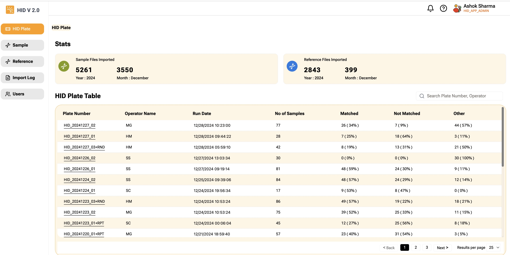

Displays Sample summary by HID Plate, Operator along with number of samples. Page also displays **Matched**, **Not Matched** and **Other** Counts

| Column | Description |
| :------ | :-----------------------------------------------------------------------------------------------|
| **Plate Number** | Plate name, data comes from the GeXP data feed.|
| **Operator**  | Operator Initial, data comes from the GeXP data feed.|
| **Controls** | Shows number of control files within HID Plate. |
| **No. of Samples** | Total number of samples within HID Plate.|
| **Matched** | Count of samples, where scoring calculation is done and the result is greater than 70%.|
| **Not Matched** | Count of samples, where scoring calculation is done and the result is less than 70%.|
| **other** | Count of samples, where scoring is not yet done due missing patient id or reference is not linked.|  
  
To see all the [samples for the HID Plate](/docs/HID-app/03-Samples%20-%20HID%20Plate.md), click on the HID Plate link. 