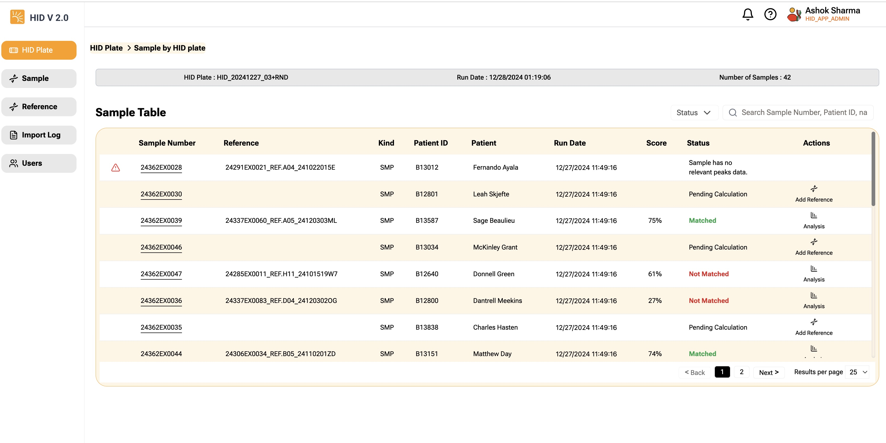

Displays Sample for the selected HID Plate  
Data is sorted by descending order of **Modified date** of the sample. Date shown is the date of most recent Sample's modified date.  

##### Top Bar Shows
HID Plate name, Modified date of the most recent sample and number of samples in this HID plate.

|Column | Description |
|:----- |:------------------------------------------------------------------------------|
|   | Shows warning if the sample failed Fragment List Validation check |
| Sample | Sample number, click sample number link to view sample raw data |
|   | Shows warning if the reference failed Fragment List Validation check |
| Reference | Reference name, sample is linked to. Once reference is linked, scoring can be done. | 
|     | If this column is blank, it indicates app has not located the reference based on the Patient ID.  |
|Kind | 'SMP' - Sample, 'REF' - Reference, 'POS' - Positive Control, 'NTC' - Negative Control |
|Patient ID | Shows patient ID. Patient ID helps linking correct reference to Sample |
|Patient Name | Patient Name  |
|HID Plate | Shows on which HID Plate this sample was processed |
| Run Date | Modified date|
|Score | Calculated Score, as per Valley Medical process |
|Status |<td><tr>**Matched** -  Matched</tr><tr>**Not Matched** - Not Matched</tr><tr>**Pending Calculation** - Either Patient ID is missing or Reference is missing</tr><tr>**Too many attempts to assign reference to sample** - Its been more than a week app couldn't find the reference. App will no longer attempt to find the reference</tr><tr>**Sample has no relevant peaks data** - Sample has no peaks, as per the definition</tr><tr>**Reference has no relevant peaks data** - Reference has no peaks, as per the definition</tr></td>|
|Action |<td><tr>**Add Reference** - Allows you to link Reference to the sample</tr><tr>**Analysis** - Allows you to view **analysis** page</tr></td>

:::tip
Hovering your mouse pointer on the warning sign will show the reason for the warning.