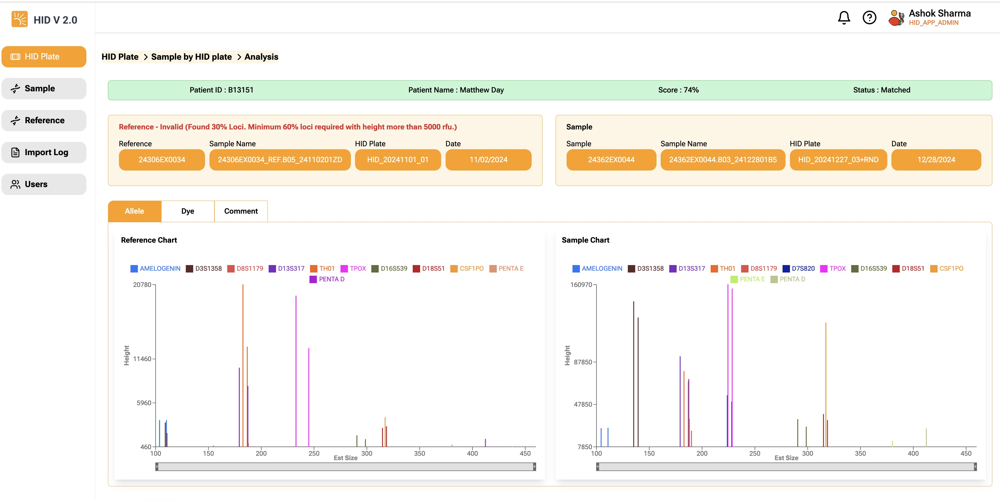
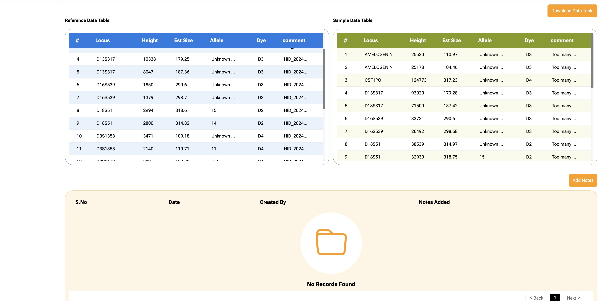

Displays selected sample analysis. Analysis page has 5 sections.  

**Top Bar**  
Shows Patient ID, Name, Calculated Score, and Status. If status is matched, the background color will show-up in green, otherwise it will show up as red.  

**Reference/Sample details**
Shows details about the reference and sample. Following details are displayed.
- Reference or Sample Number (If reference or sample has failed fragment list data validation, the title will show in **red** with the validatioin error message.)  
- Reference or Sample full name  
- Reference or Sample HID Plate name
- Reference or Sample process date    

**Charts**  
Shows chart for "Allele, Dye and Comment", charts defaults to "Allele". The chart show fragment list peaks data only.  
x-axis is mapped to estimate size of fragment list  
y-axis is mapped to height of the fragment list  

**Fragment list data**  
Shows fragment list peaks data.

**Notes**  
Allows user to enter notes for the sample. Once note is saved, it cannot be edited. You can enter multiple notes for the sample. App will display most recent notes on top of the list.

:::tip

Click download to export the sample and reference data in excel format for further analysis.