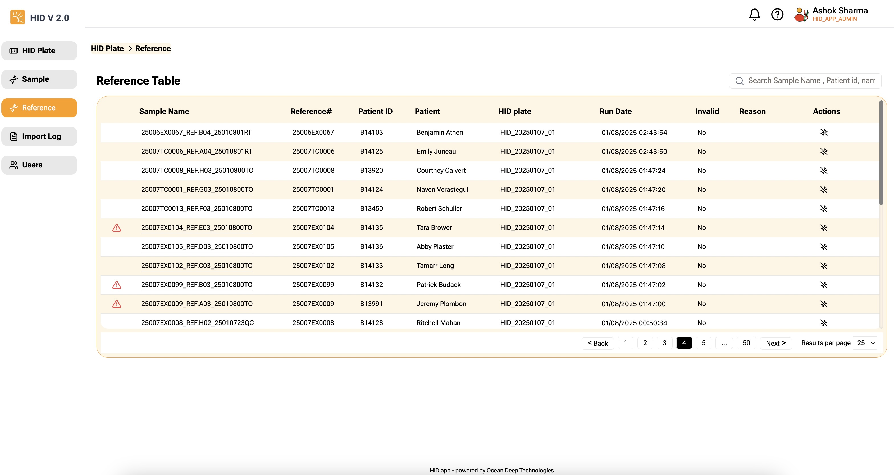

Displays Reference data in descending order of **Modified date**. Date shown is the date of most recent Reference's modified date.  

|Column | Description |
|:----- |:------------------------------------------------------------------------------|
|   | Shows warning if the sample failed Fragment List Validation check |
| Sample Name| Sample full name, click sample name link to view sample raw data |
| Reference# | Reference number. This is the number used in Patient Sample file | 
|Patient ID | Shows patient ID. Patient ID helps linking correct reference to Sample |
|Patient Name | Patient Name  |
|HID Plate | Shows on which HID Plate this sample was processed |
| Run Date | Modified date|
|Invalid | will display "Yes" if marked invalid |
| Reason | Reason for marking it invalid|
|Action |**Invalidate** - Allows you to Invalidate the Reference|

:::note  
a. Once reference is invalidated, association from Sample is removed if the reference was associated and sample goes to "Pending Calculation" status.  
b. Reference will not be allowed to link to any samples.
::: 

:::tip
Hovering your mouse pointer on the warning sign will show the reason for the warning.  
:::  

#### Action

Following page is displayed, when you click "Invalidate Reference" link.  

Enter reason and click "Invalidate" button to invalidate Reference.  
If reference is associated with sample(s), the link is removed, the sample status changes to "Pending Calculation".  
Reference will not be allowed to linked to any other samples.  