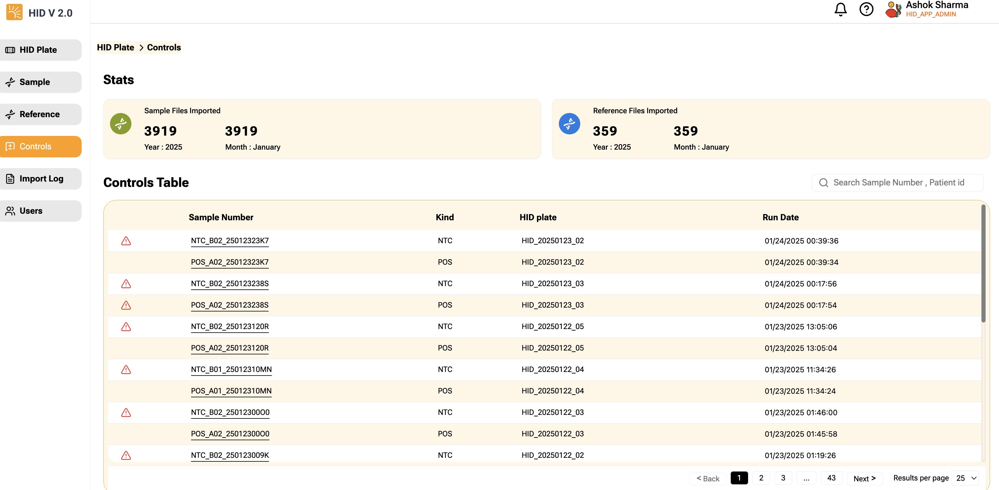

Displays Control data in descending order of **Modified date**. Date shown is the date of most recent Control's modified date.  

Control files do have any reference associated with it and hence no score or status is displayed. There is no action other than clicking the sample number that will present raw data along with fragment list data.

|Column | Description |
|:----- |:------------------------------------------------------------------------------|
|   | Shows warning if the sample failed Fragment List Validation check |
| Sample | Sample number, click sample number link to view sample raw data |
|Kind |  'POS' - Positive Control, 'NTC' - Negative Control |
|HID Plate | Shows on which HID Plate this sample was processed |
| Run Date | Modified date|

:::tip
Hovering your mouse pointer on the warning sign will show the reason for the warning.