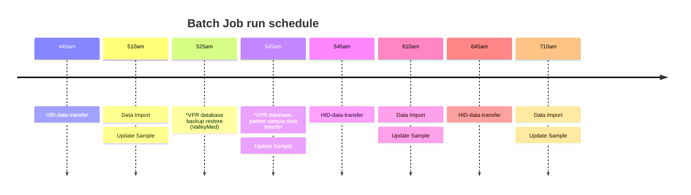

HID-data-transfer: Runs every 1 hour, starting at past 10 minutes.

```mermaid
timeline
    title Batch Job run schedule
    445am : HID-data-transfer
    510am : Data Import : Update Sample
    525am : *VPR database backup restore (ValleyMed)
    545am : *VPR database, patient sample data transfer : Update Sample 
    545am : HID-data-transfer
    610am : Data Import : Update Sample
    645am : HID-data-transfer
    710am : Data Import : Update Sample
```
###### * - Once a day