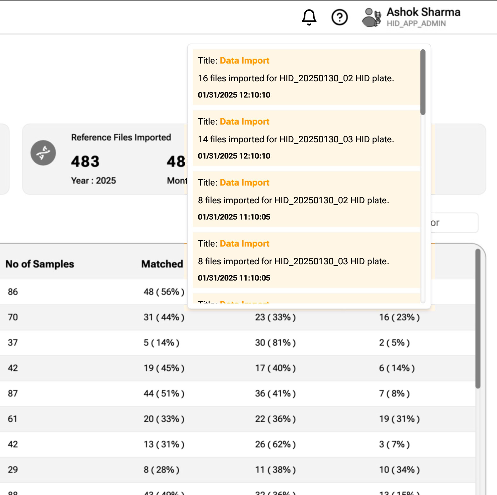

The Bell Icon on top bar, shows very important information. 

It shows 
1. Date and Time stamp of last HID data ingested.  The data is ingested every past 1 hour at 10 mins.  
2. Date and Time stamp of last VPR data import. This data is always imported once at 6:05am.  
