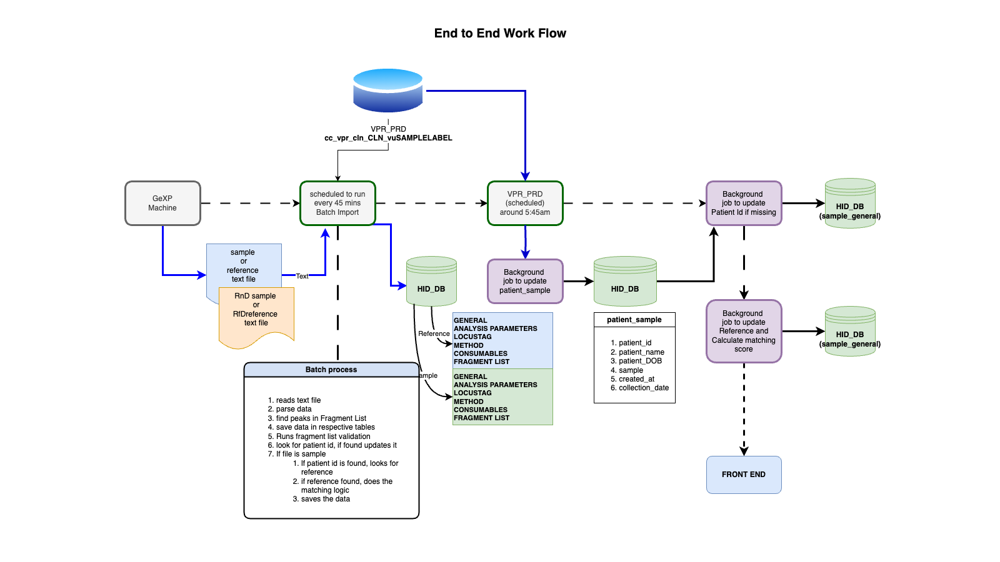

This diagram shows how data flows from GeXP machine to HiD web application.

- Data file from GeXP machine is transmitted every hour to SQL1 server's "Automation" folder
- SQL1 server runs batch script to transmit file from "Automation" folder to application server under folder "process"
- Background process runs with interval of 30 minutes at 15 and 45 minutes
- Data ingestion program, does followings:
    - parse the data in [General] [FragmentList] [Analysis Parameters] [Lucas Tag] [Method] and [Consumables] section
    - if there is no **General** section, ingestion of that data file stops with error "Invalid data file".
    - assign patient id, name and dob, if sample and patient id is found in VPR database, patient id is assigned to sample
    - if sample and patient id is assigned, batch program will find and assign (validated) reference to the sample.
    - if reference is assigned to sample, program does the score calculation using pre-defined matchin logic.
    - if sample is a reference sample, program does the validation check to ensure reference has a valid fragment list data.
    - program sends notification regarding data import
